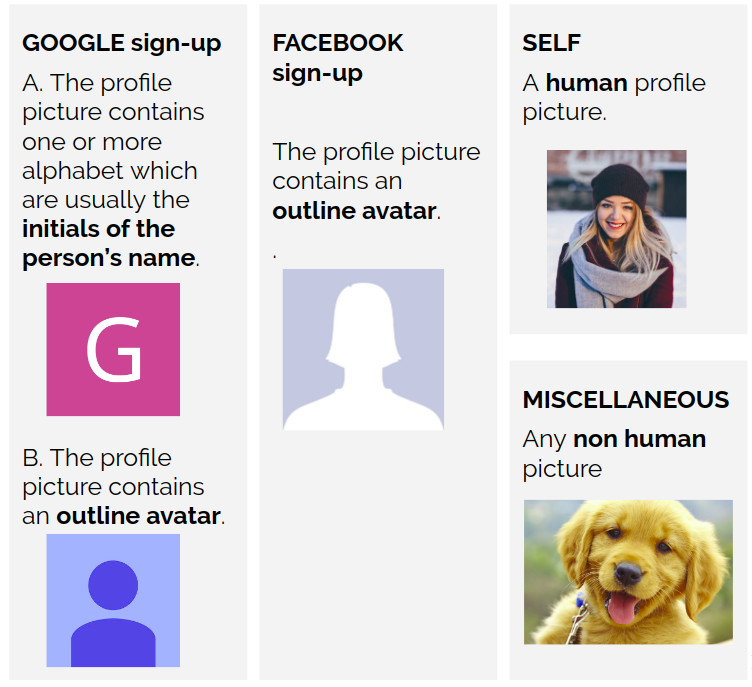

# User Sign-Up Source Identification

## Project Description

This project was implemented during my internship at SHEROES in the summer of 2019. SHEROES builds a women's community platform, offering support, resources, opportunities and interactions via Sheroes.com and the SHEROES App.

Out of the millions of women on the platform, only about 3 Lakh women have set a profile picture. The remaining either don't have an image set or have a default image from one of the social media platforms they used for sign-up.
Thus, a large proportion of these users have a default profile picture instead of one of their own but **the exact data was still unknown.**

This project identifies the source of a user's profile picture on the SHEROES platform by categorizing it into one of the 5 categories:

1. Google new sign-up
2. Google old sign-up
3. Facebook sign-up
4. Self
5. Miscellaneous

## Use Cases
- It helps in sending alerts and push notifications to those who haven’t set their own pictures.
- It also gives a better understanding of the user base from different sign-up platforms.
